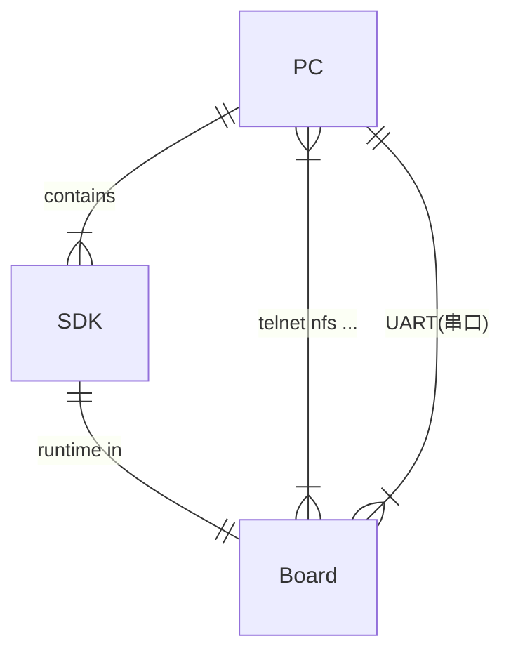

# Liwcv 嵌入式开发快速指导（Hi35xx）
*本文中提到的各种工具/软硬件，没有的话找上级主管解决*

## 名词解释
- `Hi35xx` 海思`35xx`平台，当前使用的为`Hi3519v101`和`Hi3519A`
- `MPP` 海思媒体处理软件平台(`Media Process Platform`) SDK中包含其开发环境和运行环境(包括驱动)
- `UART` 通用异步收发传输器，串口协议的一种
- `NFS` 网络文件系统

## 概述
目前本司所用嵌入式设备主要基于海思`Hi35xx`平台，使用平台计算能力进行`AI`运算、音视频输入输出等。平台操作系统选用`Linux`（芯片不同，海思提供的`Linux`内核版本也不同）。  
主要开发方式为：
1. 在`PC`端(`Linux`系统)编写基于海思`SDK`的`C/C++`代码
2. 使用海思对应平台的交叉编译工具在`PC`端对代码进行编译
3. 将程序拷贝到板子上（也可以不拷贝，直接利用文件系统映射进行读取运行）
4. 运行程序、调试等  

做这系列平台的开发需要
- **开发板** 
- **Linux系统的兼容x86架构的PC**
- **海思SDK**  

三者关系如下

一般情况下，`PC`通过串口登陆板子的终端，和板子进行交互；`PC`端维持一个`NFS server`服务，板子通过`NFS`客户端把`PC`端的某个目录映射到板端，可以通过这个桥梁进行文件的传输等操作

## 环境配置
### PC端
`PC`端担任的主要职责有三个：
1. 对板子进行指令控制（输命令，看输出）—— 需要串口工具
2. 和板子进行数据交互(传入/传出文件) —— 需要建立`NFS server`服务
3. 编译程序 —— 需要部署`SDK`
#### 串口工具
`Linux`下一般使用`minicom`，其它工具也行，不做强制要求
- Fedora
```Bash
sudo dnf install minicom
```
- Ubuntu
```Bash
sudo apt-get install minicom
```
`Windows`下工具也有很多，百度可以搜索下载到绿色版本的  
`MacOS`也有`minicom`可用
#### 建立NFS server 服务
参见[《nfs-server-establish.md》](nfs-server-establish.md)
#### 部署SDK
参照SDK文档中《Hi3519V101／Hi3516AV200 SDK 安装以及升级使用说明.txt》的前4步    
[这里](Hi3519V101-SDK-install-instruction.txt)有一份拷贝

### 板端
板端需要连接网口和串口，串口通过`USB`转换头直接接到`PC`上，网口连到和`PC`的同一网段上（不然的话要各种设置，比较麻烦）  
硬件连接好后，在`PC`端打开串口工具连接，串口配置为`8N1，115200`，不懂的话不用管，一般默认就行

Linux & MacOS
```Bash
#-c 打开ANSI color，会好看很多； -D指定串口设备，这个要根据自己PC的情况定，之后也可以设置minicom默认打开的设备名称而不需要每次都输入-D
minicom -c on -D /dev/tty.usbxxx
```
Windows打开串口工具，设置要连接的串口，连接即可  
在连接成功后的串口设备中:
```Bash
cd /etc/init.d
#这里需要一点vi编辑器的基础操作知识，可以自学一下，也可以用别的习惯的工具
vi S80network
```
修改ip地址，找一个未被占用的IP地址，改到`ipaddr=`后面，没有这个文件的话就直接修改`rcS`文件，在最后添加
```Bash
ifconfig eth0 192.168.x.x
```

## 板端程序编译&运行
这部分的前提是交叉编译器已经安装好了，并且`NFS`服务已经启动无误，而且要知道自己的板子挂载的`NFS`目录(后面会简称为`NFS`目录)在哪里
### `sample`编译
一般情况下交叉编译器安装好了之后，把其bin目录设置到环境变量的`PATH`中之后，可以直接对`sample`进行编译，前提是不要乱动`SDK`的目录结构。
一般情况下`sample`目录位于`SDK`中的`mpp*`目录下，找不到的话可以搜索。
进入`sample`目录，或者你想编译的子项目的目录，编译直接`make`即可
```Bash
make
```
这里提一点，由于SDK提供的嵌入式C运行环境有两种：`uClibc`和`glibc`，对应不同版本的编译器，`sample`中默认是`glibc`，要编译`uClibc`版本的话需要指定参数`
```Bash
make LIBC=uClibc
```
具体需要哪一种，根据板上系统而定，板上烧写的系统提供哪种运行环境就需要编译哪种程序

### 编译自己的代码
自己写的代码编译方式和普通`gcc`编译一样，只不过`gcc`换成了交叉编译链，`hi3519v101`的是`arm-hisiv5/600-linux-*`，其它就是如果用到`MPP`的库的话，要链接上用到的库。
比如编译一个`hi3519v101`平台`uClibc`版本的程序，熟悉的`HelloWorld`，命名为`test.c`
```C
#include <stdio.h>

int main(int argc, char* argv[])
{
    printf("Hello World\n");
    return 0;
}
```
终端中编译成名为`test`的可执行文件：
```Bash
arm-hisiv500-linux-gcc test.c -o test
```
就是这么简单。
### 运行
把上面编译好的`test`放在你的`NFS`目录里，确保板子的网口和串口都已经连接好了，在PC上打开串口工具，连接板子串口，板子上电，如果一切正常的话，串口工具界面就会输出板子的启动信息。
启动完成后，假如我们的`PC`中的`NFS`目录为`/home/liwcv/hi_nfs`，我们先把`NFS`目录挂载到`home`:
`mount -t nfs -o nolock 192.168.x.x:/home/liwcv/hi_nfs /home`
然后就可以去运行我们的程序了，使用串口工具进行操作:
```Bash
cd /home
./test
```
不出意外的话，会输出你想要的
